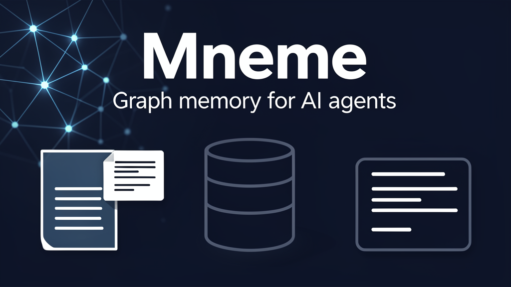

# Mneme



**Mneme** is a local-first graph memory layer for AI agents.

It turns a folder of Markdown notes into a SQLite graph, walks that graph, and renders compact visual **thought path** cards that an agent can surface proactively.

> Mneme (Μνήμη) means memory.

## What it does

- Ingests Markdown notes from a vault/folder
- Extracts notes, wikilinks, headings, tasks, dates, emails, and high-signal observations
- Stores nodes, edges, observations, and generated thoughts in SQLite
- Performs biased graph walks over unresolved, risky, recent, or connected items
- Renders thought cards as SVG, with optional PNG conversion via ImageMagick
- Provides a CLI suitable for cron jobs or agent runtimes

## Privacy model

Mneme is local-first:

- No network calls
- No telemetry
- No LLM dependency
- No cloud database
- SQLite stays wherever you put it

Important: generated SQLite databases, JSON output, SVG/PNG cards, and logs can contain snippets from your notes. Do **not** commit generated databases, private cards, or real vault content to public repositories.

Privacy-focused defaults:

- `ingest` and `run-once` rebuild the graph by default, so stale private nodes/edges are removed when a DB is reused.
- Symlinked Markdown files are skipped by default to avoid reading files outside the vault.
- Generated cards named `thought_*.svg` / `thought_*.png` and SQLite files are blocked by the included privacy scan.

## Install

```bash
git clone <this-repository-url>
cd mneme
python -m pip install -e .
```

Requirements:

- Python 3.10+
- Optional: ImageMagick (`convert` or `magick`) for PNG output. Without it, Mneme writes SVG cards.

For development:

```bash
python -m pip install -e '.[dev]'
python -m pytest -q
```

## Quick start

Use `/tmp` or another scratch location for generated outputs:

```bash
mneme run-once --vault ./examples/vault --db /tmp/mneme.sqlite --out /tmp/mneme_out
```

The command prints JSON with the generated title, path, and image path. Agent runtimes can use that image as a proactive visual memory nudge.

## CLI

### Ingest a Markdown vault

```bash
mneme ingest --vault ./examples/vault --db /tmp/mneme.sqlite
```

By default this rebuilds graph tables to avoid stale data. If you explicitly want append/update behaviour:

```bash
mneme ingest --vault ./examples/vault --db /tmp/mneme.sqlite --append
```

### Generate one thought from an existing DB

```bash
mneme thought --db /tmp/mneme.sqlite --out /tmp/mneme_out
```

### Ingest and generate in one command

```bash
mneme run-once --vault ./examples/vault --db /tmp/mneme.sqlite --out /tmp/mneme_out
```

Useful flags:

- `--hints deadline,lease,tax` — bias observation scoring and walks toward certain words
- `--hops 5` — number of graph hops in a thought path
- `--max-notes 100` — limit ingestion for a quick smoke test
- `--append` — keep existing nodes/edges instead of rebuilding; use carefully because stale data can remain
- `--follow-symlinks` — follow symlinked Markdown files that resolve inside the vault

## How it works

1. Markdown notes become graph nodes.
2. Wikilinks, headings, tasks, dates, and emails become connected nodes/edges.
3. High-signal bullets and tasks become observations.
4. Mneme chooses a biased seed node, walks nearby relationships, and creates a short thought.
5. The renderer writes a card to the output directory.

This prototype is intentionally simple: it does not claim a relationship is true just because two things co-occur. Treat cards as prompts for review, not facts.

## Safety checks before publishing changes

```bash
python -m pytest -q
python scripts/privacy_scan.py
mneme run-once --vault ./examples/vault --db /tmp/mneme_smoke.sqlite --out /tmp/mneme_smoke_out
```

The privacy scan fails on common generated artifacts, private paths, emails, secret-like assignments, private-key blocks, and common token prefixes. Projects can add custom forbidden terms without storing them in the repo:

```bash
MNEME_FORBIDDEN_TERMS="private-project-name,internal-domain" python scripts/privacy_scan.py
```

## Status

Phase 1 prototype. Next improvements: configurable ontologies, contradiction detection, stale open-loop detection, semantic traversal, richer render themes, and agent framework adapters.
