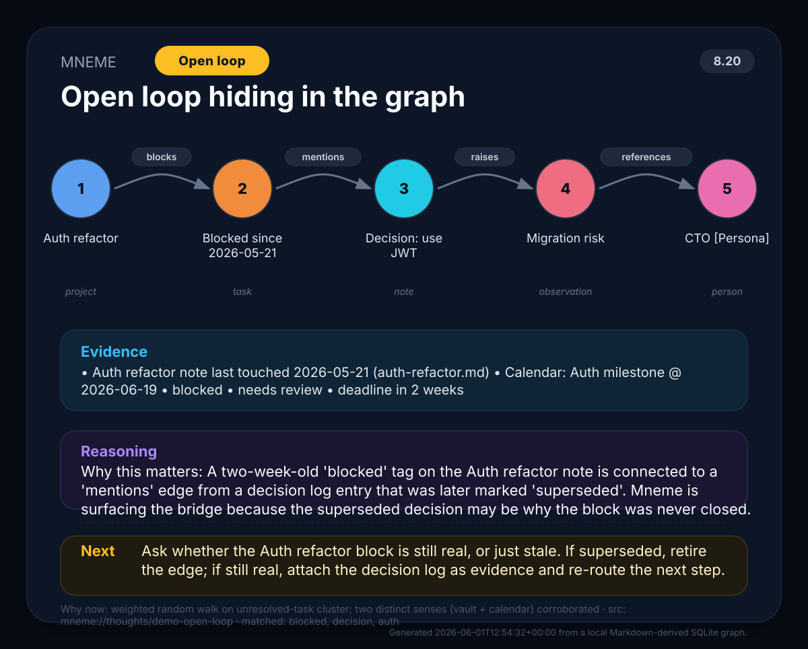

# Mneme


**Mneme** is a local-first graph memory layer for AI agents.

It turns Markdown notes into an inspectable SQLite memory graph: notes become nodes, links/tasks/bullets become evidence-backed edges and observations, and agents can use the graph to generate thought paths, audit why relationships exist, or build prompt-time context packs.

> Mneme (Μνήμη) means memory.

## Current status

Mneme is an **alpha** public package. The public repository contains the sanitized, reusable core:

- Markdown vault ingestion
- SQLite graph storage
- relationship ontology seeding
- edge evidence + debug/audit logs
- retrieval-backed context and thought surfacing
- thought-path generation and rendered cards
- SVG/PNG thought-card rendering
- privacy-first rebuild defaults and scans
- World-model layer: durable state assertions, deterministic predictions, and an auditable action ledger on top of the graph
- CLI commands for ingestion, retrieval, thought surfacing, scoped graph memory, research resolution writeback, edge explanation, world-model state/prediction/action management, and agent preflight

The private dogfood runtime is also exploring active synapse validation, graph workbench UX, and prompt-time retrieval. Those patterns are documented below as design direction, but only shipped public CLI commands are listed in the CLI section.

The shared public/private graph semantics are documented in [GRAPH_CONTRACT.md](GRAPH_CONTRACT.md), including edge/synapse status mapping and promotion rules.

The repo also includes a Hermes-compatible skill bundle at
`skills/mneme-agent-brain/`. Install or point Hermes at that
directory when an agent should operate Mneme as a working brain. The skill
contains the `SKILL.md` entrypoint, a detailed operator runbook, and a smoke
helper that delegates to `scripts/hermes_brain_ready.sh`. Hermes install and
update steps live in
[`skills/mneme-agent-brain/references/install-update.md`](skills/mneme-agent-brain/references/install-update.md)
and are summarised in the [Hermes install](#hermes-install) section below.

### Hook injection safety

Hosts that wire Mneme as a pre-LLM hook should use the repo-managed hook at
[`scripts/mneme_senses_context_hook.py`](scripts/mneme_senses_context_hook.py)
and install/check it with:

```bash
python scripts/sync_hermes_hook.py
python scripts/sync_hermes_hook.py --check
```

The hook follows the compact injection pattern documented at
[`skills/mneme/references/hook-directive-order.md`](skills/mneme/references/hook-directive-order.md):
do **not** inject large `MNEME RETRIEVAL PATH` / `MNEME BOTH PATH` protocol blocks
or long `PRIMARY DIRECTIVE` banners into every prompt. Use a short reminder that
points agents to preflight/world state/watch, and strip leaked hook markers before
classifying user text. The public test suite (`tests/test_hook_directive_order.py`)
covers the invariant and executes the real repo-managed hook.

## What it does

- Ingests Markdown notes from a vault/folder.
- Extracts notes, wikilinks, headings, tasks, dates, email-like strings, and high-signal observations.
- Stores nodes, edges, observations, generated thoughts, relationship types, and edge debug logs in SQLite.
- Distinguishes **reference/structural edges** from **semantic claims** through a seeded relationship ontology.
- Records why an edge exists: source path, evidence text, confidence, extraction rule, and later validation/audit events.
- Performs biased graph walks over unresolved, risky, recent, or connected items.
- Renders compact thought cards as SVG, with optional PNG conversion via ImageMagick.
- Provides a CLI suitable for cron jobs, local agent runtimes, and private graph workbenches.

## Mental model

Mneme treats memory as an auditable graph:

```text
Markdown notes
  -> nodes / observations / evidence-backed edges
  -> SQLite graph + audit log
  -> graph walks, explanations, workbench APIs, or prompt context
```

A line between two nodes is not automatically a fact. Mneme separates:

- **Reference edges** — e.g. `links_to`, created from explicit Markdown wikilinks. Useful for navigation, but not proof of a real-world relationship.
- **Extraction edges** — e.g. `mentions_date`, `mentions_email`, created from text patterns.
- **Observation edges** — e.g. `has_fact`, `has_risk`, `has_blocked`, created from scored bullets/tasks.
- **Semantic relationships** — e.g. `belongs_to`, `located_in`, `part_of`, `father_of`. These are marked as requiring validation before an agent treats them as real-world claims.

This keeps the graph useful without letting weak co-occurrence or casual links become hallucinated truth.

### World model layer

The new **world model** is a small durable layer above the rebuildable graph. The graph remains Mneme's perception/index: it can be rebuilt from Markdown and senses. The world model stores state that should survive graph churn:

- **State**: `world_state_assertions` records current, source-backed beliefs such as “Person X belongs to Organisation Y”. Assertions reuse the same validation contract as active research edges, so low-confidence observations do not become durable facts.
- **Prediction**: `world_predictions` records future expectations in structured JSON. Checks are deterministic against stored `sense_events` and observations — no LLM judgement.
- **Action**: `world_actions` is a ledger table for external side effects. The public helper enforces that side-effectful records carry a provider handle (`external_ref` or `tool_call_id`) before they can be stored.

The point is not to replace the graph. It is to let agents ask: “What do I currently believe?”, “What did I expect to happen?”, and “Did new evidence confirm or miss that expectation?” See [docs/world-model-v1.md](docs/world-model-v1.md) for the design notes.

## What a thought card looks like

When Mneme surfaces a thought, the CLI renders a self-contained SVG/PNG
card so the human can see at a glance what was found, why, and what to
do next. The example below is a fictional demo (the `[Persona]` token
and the `mneme://thoughts/demo-open-loop` URI make this unmistakable).
A real card would carry your actual node names and source paths.



A card carries:

- **Header** — wordmark, classification badge (`Open loop` / `Deadline` /
  `Surface match` / `Reasoned walk`), score chip.
- **Path** — the multi-hop graph walk that surfaced, with the relation
  (e.g. `blocks`, `mentions`, `raises`, `references`) shown as a chip
  between each pair of nodes. Paths longer than 12 nodes get a `+N more`
  overflow chip.
- **Evidence** — the thought's source-backed snippets and observations,
  deduped, capped at 5 lines with a `+N more in JSON output` marker when
  truncated. Hidden entirely when no observations exist.
- **Reasoning** — the insight, with a distinct purple/violet tint so it
  reads as a third colored band.
- **Next** — a concrete next step in an amber tint.
- **Footer** — `Why now:` explanation, `src:` URI, `matched:` terms, and
  the generated timestamp.

Theme can be `dark` (default) or `light`, selectable via the
`MNEME_CARD_THEME` env var or the `theme=` kwarg on `render_card`.

## Privacy model

Mneme is local-first:

- No network calls in the public core
- No telemetry
- No required LLM dependency
- No cloud database
- SQLite stays wherever you put it

Important: generated SQLite databases, JSON output, SVG/PNG cards, and logs can contain snippets from your notes. Do **not** commit generated databases, private cards, logs, or real vault content to public repositories.

Privacy-focused defaults:

- `ingest` and `run-once` rebuild graph tables by default, so stale private nodes/edges are removed when a DB is reused.
- Symlinked Markdown files are skipped by default to avoid reading files outside the vault.
- Generated cards named `thought_*.svg` / `thought_*.png` and SQLite files are blocked by the included privacy scan.
- Public examples are intentionally small and fictional.

## Backup and restore policy

Mneme stores meaningful memory state in SQLite, so backup is part of the workflow, not an afterthought.

Public Mneme remains local-first and does not make cloud calls by default. For any private deployment that runs scheduled thought cards, validation, migrations, or rebuilds:

1. Take a SQLite-consistent snapshot before risky work. Use SQLite's backup API or `.backup`; do not rely on copying a live SQLite file as the only backup.
2. Include a manifest with integrity data: creation time, source DB path, checksums, and counts such as edges/synapses by status.
3. Compress and encrypt the backup before it leaves the machine.
4. Verify decryptability and `PRAGMA integrity_check` before considering the backup valid.
5. Keep local encrypted backups and a restore script that makes a safety copy before replacing the live DB.
6. If the user wants Google Drive backup, use Google Workspace/Drive tooling such as `gws drive +upload` first. Use rclone or other remotes only as fallback.
7. Never print, commit, or send the backup passphrase. If the encrypted backup is stored off-box, the passphrase must be stored separately somewhere safe or cloud restore will be impossible after machine loss.

A private deployment can schedule this as: snapshot -> manifest/checksum -> encrypt -> verify -> upload to Drive -> periodically test restore verification.

## Install

One-command install/update on Linux/macOS:

```bash
curl -fsSL https://raw.githubusercontent.com/georgeantonopoulos/mneme/main/scripts/install.sh | bash
```

Manual install from a checkout:

```bash
git clone <this-repository-url>
cd mneme
python -m pip install -e .
```

Requirements:

- Python 3.10+
- Optional: ImageMagick (`convert` or `magick`) for PNG output. Without it, Mneme writes SVG cards.

### Install / update notes

The installer creates/updates the `mneme` CLI. After installation, check the Markdown editor commands with:

```bash
mneme note --help
```

The package includes the graph memory engine and a small path-safe Markdown editor; there is no separate editor plugin to install.

## Hermes install

Hermes needs two things from Mneme:

1. The `mneme` CLI on `PATH` (installed by the standard install above).
2. The `skills/mneme-agent-brain/` skill directory reachable from the
   active Hermes profile (for example
   `~/.hermes/skills/mneme-agent-brain/`).

The fast path:

```bash
# 1. Install or update the CLI
curl -fsSL https://raw.githubusercontent.com/georgeantonopoulos/mneme/main/scripts/install.sh | bash

# 2. Wire the skill into the active Hermes profile
mkdir -p ~/.hermes/skills
ln -sfn ~/.local/share/mneme/skills/mneme-agent-brain ~/.hermes/skills/mneme-agent-brain

# 3. Smoke-test the wiring. The helper runs the full brain harness,
#    including contract check, world tick dry-run, retrieval, surface,
#    and agent preflight.
MNEME_BRAIN_DEPTH=smoke ~/.local/share/mneme/scripts/hermes_brain_ready.sh /tmp/mneme_smoke.sqlite
```

If your Hermes profile lives somewhere other than `~/.hermes`, set
`HERMES_HOME` to that directory before step 2 and substitute the
profile's `skills/` path in the symlink.

Manual checkout (for hermes profiles that need the repo on disk):

```bash
git clone https://github.com/georgeantonopoulos/mneme.git ~/.local/share/mneme
python -m pip install -e ~/.local/share/mneme
ln -sfn ~/.local/share/mneme/skills/mneme-agent-brain ~/.hermes/skills/mneme-agent-brain
```

The full operator runbook (env-var overrides, profile isolation, brain
harness depths) lives at
[`skills/mneme-agent-brain/references/install-update.md`](skills/mneme-agent-brain/references/install-update.md).

### Hermes world-model loop

The Mneme skill is intentionally vault-agnostic: it never assumes a particular
folder layout, private database path, or user's notes. Hermes operators provide
`$DB`, `$VAULT`, and `$PROMPT`; the skill describes the portable state/action/
prediction loop that any Mneme-backed agent can run.

Before Hermes uses Mneme context in an answer or action, run preflight:

```bash
mneme agent preflight --db "$DB" --prompt "$PROMPT"
```

For tasks that depend on current state or expected future evidence, inspect the
world model first:

```bash
mneme state list --db "$DB" --status current
NOW=$(python3 -c 'from datetime import datetime, timezone; print(datetime.now(timezone.utc).isoformat())')
mneme predict due --db "$DB" --before "$NOW"
mneme world watch --db "$DB" --lead 1d
mneme world tick --db "$DB" --before "$NOW" --dry-run
```

Use `world watch` as a read-only radar for open predictions that are due soon
but have no matching evidence yet. Use `world tick --dry-run` during interactive
operation so the agent can see lapsed open loops, due predictions, pre-failure
watch items, contract status, and attention items without changing prediction
state. Run mutating `world tick` from explicit maintenance jobs when you want
open predictions to become `confirmed`, `missed`, or `unverifiable`.

When a source-backed resolution creates a future expectation, write it into the
same payload with `predictions[]`; for standalone expectations use
`mneme predict add --file prediction.json`. When an integration records a real
side effect, it should call the action-recording helper with an external
provider reference or tool-call ID so `world_actions` becomes an auditable action
ledger rather than chat history archaeology. Add an optional `verify` block with
an explicit `sense_type` when that side effect should spawn a deterministic
verification prediction.

```bash
mneme action record --db "$DB" --file action.json
```

Side-effectful actions must include `external_ref` or `tool_call_id`; otherwise
the contract rejects the record.

Canonicalize fragmented subject names with aliases. `alias add` affects future
writes; `alias merge` also rewrites existing world-state assertions and
recomputes current/superseded pointers.

```bash
mneme alias add "the landlord" "St James" --db "$DB"
mneme alias merge "the landlord" "St James" --db "$DB" --dry-run
mneme alias ls --db "$DB"
```

Use the scored retrieval eval whenever retrieval/world-model scoring changes:

```bash
mneme eval retrieval --demo --min-score 0.9
```

### Hook directive ordering in Hermes

If the Hermes deployment uses a pre-LLM hook that injects a Mneme
`path` (`retrieval`, `correction`, or `both`) into the agent's system
prompt, install the repo-managed hook and check drift:

```bash
python scripts/sync_hermes_hook.py
python scripts/sync_hermes_hook.py --check
```

The hook MUST keep compact reminders ahead of any Mneme operational detail and
strip leaked hook markers before classifying user text. Hermes hosts that inject
large manuals or omit the compact ordering have been observed to lose the user's
request to a Mneme writeback loop and stop responding. The public test
`tests/test_hook_directive_order.py` pins the invariant and executes the real
repo-managed hook; run it after any hook changes:

```bash
python -m pytest tests/test_hook_directive_order.py -v
```

## Quick start

Configure Mneme once, validate it, then use short commands:

```bash
mneme init --vault ./examples/vault --db /tmp/mneme.sqlite --out /tmp/mneme_out
mneme doctor
mneme update
mneme candidates
mneme promote-candidates --dry-run
mneme retrieve --prompt "what should the agent remember here?"
mneme surface --prompt "what should surface now?"
mneme thought
```

Research results can be written back as evidence packs plus weighted graph edges:

```bash
mneme resolve --file research-resolution.json
```

World-model predictions can be added and checked deterministically:

```bash
mneme state list --db /tmp/mneme.sqlite --subject "school"
mneme state explain ASSERTION_ID --db /tmp/mneme.sqlite
mneme predict add --db /tmp/mneme.sqlite --file prediction.json
mneme predict due --db /tmp/mneme.sqlite --before 2026-07-02T12:00:00+00:00
mneme world tick --db /tmp/mneme.sqlite --before 2026-07-02T12:00:00+00:00 --dry-run
```

You can keep multiple configs if needed:

```bash
mneme --config /tmp/project-mneme.json init --vault ./examples/vault --db /tmp/project.sqlite --out /tmp/project_out
mneme --config /tmp/project-mneme.json run-once
```

Or run one-off commands with explicit paths:

```bash
mneme run-once --vault ./examples/vault --db /tmp/mneme.sqlite --out /tmp/mneme_out
```

The command prints JSON with the generated title, thought path, and image path. Agent runtimes can use that image as a proactive visual memory nudge.

## CLI

### Create and validate config

```bash
mneme init --vault ./examples/vault --db /tmp/mneme.sqlite --out /tmp/mneme_out
mneme doctor
```

Default config path is `~/.config/mneme/config.json`. Pass `--config /path/to/config.json` before the subcommand to use another config. Once configured, `ingest`, `update`, `retrieve`, `surface`, `thought`, `run-once`, and `write` can read missing `--vault`, `--db`, or `--out` values from config when that command needs them.

### Ingest a Markdown vault

```bash
mneme ingest --vault ./examples/vault --db /tmp/mneme.sqlite
```

By default this rebuilds graph tables to avoid stale data and keeps deterministic navigation/extraction edges as `candidate` rather than making every parsed link active. Source-contained observation edges can be active; durable validated active edges and killed tombstones are preserved across rebuilds.

If you want to refresh the graph while preserving generated thought history, use `update`:

```bash
mneme update --vault ./examples/vault --db /tmp/mneme.sqlite
```

If you explicitly want append-only behaviour:

```bash
mneme ingest --vault ./examples/vault --db /tmp/mneme.sqlite --append
```

### Candidate promotion

Mneme is selective by default: parsed links/headings/dates/emails remain candidates until review or validation. To inspect candidate paths:

```bash
mneme candidates --db /tmp/mneme.sqlite
```

To opt into bulk activation, run a dry run first. The default mode only promotes validated research candidates; `--mode all` is intentionally explicit because it can make the graph noisy.

```bash
mneme promote-candidates --db /tmp/mneme.sqlite --dry-run
mneme promote-candidates --db /tmp/mneme.sqlite --mode validated-only
# explicit noisy option:
mneme promote-candidates --db /tmp/mneme.sqlite --mode all
```

### Safely edit Markdown notes

Mneme ships with a small path-safe Markdown editor for agents and scripts. It is part of the installed `mneme` CLI, returns JSON, uses vault-relative `.md` paths only, writes atomically, creates backups for changed existing notes, and supports dry-run diffs.

```bash
mneme note read Projects/new-note.md --vault ./examples/vault
mneme note write Projects/new-note.md --vault ./examples/vault --mode create --content '# New note
'
mneme note replace Projects/new-note.md --vault ./examples/vault --find 'New note' --replace 'Updated note' --dry-run
mneme note upsert-section Projects/new-note.md --vault ./examples/vault --heading Status --content 'Ready for review'
mneme note add-bullet Projects/new-note.md --vault ./examples/vault --heading Tasks --bullet 'Follow up'
```

Use `mneme note upsert-section` for section-level updates instead of fragile multiline find/replace. Use `mneme note add-bullet` for deduped bullets under a heading. These commands are intentionally small: exact replace, section upsert, bullet insertion, read, and write — not a full Markdown platform.

The older top-level `mneme write` command remains as a simple compatibility shortcut:

```bash
mneme write --vault ./examples/vault --path Projects/new-note.md --mode create --content '# New note
'
printf -- '- Follow up\n' | mneme write --vault ./examples/vault --path Projects/new-note.md --mode append
```

`mneme note` and `mneme write` only accept relative `.md` paths that resolve inside the vault. Modes are `create`, `append`, and `overwrite`.

For development:

```bash
python -m pip install -e '.[dev]'
python -m pytest -q
```


### Write resolved research back to the graph

When an agent finishes source-backed research, pass a JSON resolution payload to `mneme resolve`. Mneme writes a durable Markdown evidence pack under `Sources/` and creates weighted graph edges.

```bash
mneme resolve --vault ./examples/vault --db /tmp/mneme.sqlite --file research-resolution.json
```

Minimal payload:

```json
{
  "slug": "school-clubs",
  "title": "School clubs resolved",
  "date": "2026-04-26",
  "sources_checked": ["email", "payment", "calendar", "vault"],
  "claims": [
    {
      "subject": "Example Child",
      "subject_type": "person",
      "predicate": "attends_activity",
      "object": "Handwriting Club",
      "object_type": "activity",
      "confidence": 0.94,
      "strength": 0.93,
      "certainty": "confirmed",
      "source_type": "payment",
      "evidence": "Payment receipt and school brochure confirm the club timing."
    }
  ],
  "unresolved": ["Morning club paid but child assignment is unclear."]
}
```

Safety rule: only sourced, confirmed/certain claims at or above `--active-threshold` (`0.90` by default) become `active` edges. Pending, unsupported, or lower-confidence claims become `candidate` edges. Candidate edges are stored for audit and follow-up, but graph walks/thoughts ignore them so unresolved claims do not become proactive “truth.”

The command accepts JSON via `--file` or stdin, which keeps the interface simple for future Node/npm wrappers.


### World model: durable state and deterministic predictions

The world-model commands are opt-in and local. They create/use three tables in the same SQLite database:

| Table | Purpose | v1 producer |
|---|---|---|
| `world_state_assertions` | Durable current beliefs that survive graph rebuilds | `mneme resolve` / `remember_graph` assertions when claim validation passes |
| `world_predictions` | Machine-checkable expectations about future sensed evidence | `mneme predict add` |
| `world_actions` | External-action ledger with side-effect handle enforcement | `record_action()` helper; higher-level producers can call it later |

A minimal prediction file looks like this:

```json
{
  "id": "example-school-confirmation",
  "title": "School confirmation should arrive",
  "prediction_type": "confirmation_expected",
  "match_json": {
    "sense_type": "md",
    "observation_terms_all": ["school", "confirmation"]
  },
  "check_after": "2026-07-01T00:00:00+00:00",
  "expires_at": "2026-07-03T00:00:00+00:00",
  "confidence": 0.8
}
```

Commands:

```bash
# current durable beliefs
mneme state list --db /tmp/mneme.sqlite --status current
mneme state explain ASSERTION_ID --db /tmp/mneme.sqlite
mneme state backfill --db /tmp/mneme.sqlite --dry-run

# deterministic expectations
mneme predict add --db /tmp/mneme.sqlite --file prediction.json
mneme predict due --db /tmp/mneme.sqlite --before 2026-07-02T12:00:00+00:00
mneme predict check --db /tmp/mneme.sqlite --id example-school-confirmation --dry-run
mneme world watch --db /tmp/mneme.sqlite --lead 1d
mneme world tick --db /tmp/mneme.sqlite --before 2026-07-02T12:00:00+00:00 --dry-run

# canonical world-state subjects
mneme alias add "the landlord" "St James" --db /tmp/mneme.sqlite
mneme alias merge "the landlord" "St James" --db /tmp/mneme.sqlite --dry-run
mneme alias ls --db /tmp/mneme.sqlite

# retrieval scoring regression guard
mneme eval retrieval --demo --min-score 0.9
```

`mneme world tick` runs the normal graph tick first, checks due predictions, reports lapsed open-loop assertions, runs the DB contract checks, and returns an attention list. Use `--dry-run` to evaluate prediction transitions without committing them:

```json
{
  "ok": true,
  "graph": {"candidates_updated": 4, "observations_considered": 5},
  "predictions": {"ok": true, "due": 1, "checked": 1, "results": []}
}
```

Safety rules:

- Default rebuild/update paths preserve world-model rows.
- Only explicit scoped `mneme://...` forgets cascade into world-model rows.
- `predict due` is read/list behavior and does not create world-model tables on a graph-only DB.
- `predict check` is intentionally mutating unless `--dry-run` is passed because it records prediction outcome/status.
- Prediction IDs are content-hash deterministic when the payload omits `id`, so replayed `resolve` payloads do not duplicate expectations.
- A missed prediction linked to `subject_assertion_id` weakens that assertion's confidence once, using the fixed v1 factor.
- Retrieval/preflight can include world-model rows with explicit `truth_policy` values such as `current_state_assertion`, `open_prediction`, and `missed_prediction`.
- Prediction matching is structured/deterministic over stored `sense_events` and observations.

### Generate one thought from an existing DB

`mneme thought` now uses the proactive scorer by default: it ranks high-signal observations, open loops, deadlines, hint matches, important note types, and recently-surfaced penalties before rendering a card.

Inspect candidates before generating:

```bash
mneme candidates --db /tmp/mneme.sqlite --limit 5
```

Explain scored and suppressed candidates:

```bash
mneme debug-candidates --db /tmp/mneme.sqlite --include-skipped
```

Generate the top thought card:

```bash
mneme thought --db /tmp/mneme.sqlite --out /tmp/mneme_out
```

### Retrieve prompt-time context

Build a deterministic local context pack for an agent prompt:

```bash
mneme retrieve --db /tmp/mneme.sqlite --prompt "What needs follow-up for the supplier?" --budget 2500 --max-items 8
```

`retrieve` uses the same scoring core as `candidates` and `thought`. It returns
source-backed observations, relevant edges, score factors, freshness/source
quality notes, skipped-item reasons, and a `truth_policy` for every edge. Killed
edges are excluded. Candidate semantic edges may be shown as `candidate_only`,
but they are not phrased as facts.

### Surface thoughts from retrieval

Use `surface` when an agent wants thought cards from the same cluster-aware,
brain-labelled retrieval path instead of a random walk:

```bash
mneme surface --db /tmp/mneme.sqlite --prompt "what should I remember about supplier launch readiness?" --limit 5
```

Each surfaced thought keeps the generated `title`, `insight`, `action`, and
graph `path`, plus a `surface` block with the retrieval item, matched terms,
cluster, brain label, and truth policy that caused it to appear. The response
also includes `suggested_actions`. For example, a source-contained observation
may suggest appending a bullet under `Next Actions`; a candidate synapse may
suggest explicit validation or deletion before it is trusted.

### Add and remove scoped agent memory

Agents can add working memory to the graph without editing Markdown notes by
using a `mneme://` source namespace:

```bash
mneme remember add --db /tmp/mneme.sqlite --file /tmp/agent-memory.json
mneme surface --db /tmp/mneme.sqlite --prompt "temporary validation memory"
mneme remember remove --db /tmp/mneme.sqlite --source-path mneme://test/validation
```

Payloads may contain `nodes`, `edges`, and `observations`. Edges and
observations must reference nodes from the same payload, which keeps temporary
memory removable as a unit:

```json
{
  "source_path": "mneme://test/validation",
  "nodes": [
    {"ref": "agent", "type": "agent", "name": "Test agent"},
    {"ref": "task", "type": "task", "name": "Validate retrieval"}
  ],
  "edges": [
    {"src": "agent", "dst": "task", "relation": "relates_to", "status": "active"}
  ],
  "observations": [
    {"node": "task", "kind": "fact", "text": "Validate retrieval before trusting output.", "score": 5}
  ]
}
```

`remember remove` only accepts `mneme://` sources. That keeps vault-ingested
notes and user-authored Markdown outside the deletion path.

### Build the Hermes-ready working brain

The working-brain pipeline keeps graph structure deterministic and runs model
labelling as a replaceable harness step. A local Ollama model is useful for
dogfooding, while Hermes can pass its own command through the same interface.

```bash
mneme consolidate \
  --db /tmp/mneme.sqlite \
  --label-provider ollama \
  --label-model gemma4:e4b \
  --label-max-clusters 25

mneme brain label \
  --db /tmp/mneme.sqlite \
  --targets cluster,node,synapse,relationship \
  --max-clusters 25 \
  --max-nodes 50 \
  --max-synapses 50 \
  --max-relationships 25 \
  --label-provider ollama \
  --label-model gemma4:e4b

mneme brain report --db /tmp/mneme.sqlite
mneme retrieve --db /tmp/mneme.sqlite --prompt "what should the agent remember here?"
```

Hermes can swap the model runner without changing Mneme's graph logic:

```bash
mneme brain label \
  --db /tmp/mneme.sqlite \
  --targets cluster,node,synapse,relationship \
  --label-provider hermes \
  --label-command "hermes label --json"
```

For a single smoke script:

```bash
MNEME_LABEL_PROVIDER=ollama MNEME_LABEL_MODEL=gemma4:e4b \
  scripts/hermes_brain_ready.sh /tmp/mneme.sqlite "retrieval prompt"
```

The script runs the full harness path Hermes needs before trusting the DB:
`consolidate`, `brain label`, `brain report`, `retrieve`, and `surface`. Set
`MNEME_SURFACE_LIMIT` to change how many retrieval-backed thoughts the final
surface check returns.

Set `MNEME_BRAIN_DEPTH` when the agent needs a different pass size:

```bash
MNEME_BRAIN_DEPTH=smoke scripts/hermes_brain_ready.sh /tmp/mneme.sqlite
MNEME_BRAIN_DEPTH=default scripts/hermes_brain_ready.sh /tmp/mneme.sqlite
MNEME_BRAIN_DEPTH=deep scripts/hermes_brain_ready.sh /tmp/mneme.sqlite
MNEME_BRAIN_DEPTH=full scripts/hermes_brain_ready.sh /tmp/mneme.sqlite
```

`smoke` labels a tiny proof set, `default` labels the largest clusters plus top
nodes and synapses, `deep` labels every discovered cluster plus a broader active
frontier, and `full` attempts to label every eligible target. Individual
`MNEME_LABEL_MAX_*` values still override the preset. `mneme brain report`
returns per-target coverage so Hermes can tell whether the latest brain is
shallow, moderate, or deep before trusting retrieval.

`retrieve` includes `clusters` and `brain_labels` in its JSON response, and
returned items may include `cluster` and `brain_label` metadata showing why a
node or synapse entered the context pack.

### Ingest and generate in one command

```bash
mneme run-once --vault ./examples/vault --db /tmp/mneme.sqlite --out /tmp/mneme_out
```

Useful flags:

- `--hints deadline,lease,tax` — bias observation scoring and walks toward certain words
- `--hops 5` — number of graph hops in a thought path
- `--max-notes 100` — limit ingestion for a quick smoke test
- `--append` — keep existing nodes/edges instead of rebuilding; use carefully because stale data can remain
- `--follow-symlinks` — follow symlinked Markdown files that resolve inside the vault

### Explain why an edge exists

```bash
mneme explain-edge <edge-id> --db /tmp/mneme.sqlite
```

This prints:

- the edge and its source/destination nodes
- evidence text and source path
- relationship type metadata
- whether the relationship type requires validation
- debug/audit timeline entries

Example use case: a graph workbench can show why two nodes are connected instead of merely drawing a line.

## Relationship ontology

Mneme seeds a small relationship ontology in SQLite. Current categories include:

| Category | Examples | Meaning |
|---|---|---|
| `reference` | `links_to`, `linked_from` | Navigational Markdown references. Useful, but not proof of a semantic claim. |
| `structure` | `has_heading` | Document structure extracted from Markdown. |
| `extraction` | `mentions_date`, `mentions_email` | Pattern-extracted facts from text. |
| `observation` | `has_fact`, `has_risk`, `has_blocked`, `has_done` | Scored bullets/tasks that may be useful to an agent. |
| `semantic` | `belongs_to`, `located_in`, `part_of`, `father_of`, `attends_activity` | Real-world claims; should be validated before being treated as facts. |
| `semantic_pending` | `requested_activity` | Pending/requested real-world claims; useful for follow-up, not resolved truth. |

Unknown relationship types default to validation-required.

## Edge audit log

Every created edge can carry a debug entry explaining its origin. For example, an edge generated from `[[Beta]]` stores that it came from an explicit Markdown wikilink, not from semantic reasoning.

Agents and UIs should use this audit trail to answer:

- Why does this edge exist?
- Which source text created it?
- Is it a navigational reference or a semantic claim?
- Was it later validated, rejected, or superseded?

The public package currently logs creation events. Private deployments can extend the same table with validation, rejection, or lifecycle events.

## Graph workbench / UI design

Mneme's graph-building layer is intentionally location-agnostic: callers pass `--vault`, `--db`, and `--out`. A workbench should preserve that model rather than hard-coding deployment paths.

Recommended public packaging shape:

```bash
mneme ingest --vault /path/to/markdown --db /path/to/mneme.sqlite
mneme retrieve --db /path/to/mneme.sqlite --prompt "what should the agent remember here?"
```

The prompt-time retrieval layer is available through the public `mneme retrieve`
CLI command. A future served workbench should be optional, read-only by default,
and configurable for:

- graph DB path
- host/port
- URL mount path
- auth/reverse-proxy layer
- output/static asset directory
- node/link limits

For large graphs, workbench implementations should:

- auto-frame from actual node bounds
- support pointer events: drag, pan, pinch-zoom, and double-tap/frame on mobile
- merge aliases/path entities/display-title notes into canonical nodes before rendering
- cull offscreen nodes/links
- cap physics simulation work
- display relationship type, evidence, source path, and audit status in the details panel

## Agent / prompt-time retrieval direction

Mneme's long-term role is not just thought cards. It should also act as a fast context selector for agents:

```text
user prompt
  -> local Mneme retrieval over active/high-confidence graph context
  -> compact evidence pack
  -> model response grounded in source-backed memory
```

Recommended retrieval scoring direction:

1. active semantic relationships
2. strong active provenance/reference relationships
3. high `strength × confidence`
4. trusted source type
5. freshness / cooldown / reinforcement age
6. exact entity and lexical match
7. observation fallback
8. candidate or weak co-occurrence edges last

Killed/rejected edges should be excluded, and stale/low-strength/noisy observations should be demoted even when they lexically match the prompt.

This prompt-time retrieval layer is available through the public `mneme retrieve` CLI command.

## How it works today

1. Markdown notes become graph nodes.
2. Wikilinks, headings, tasks, dates, and email-like strings become connected nodes/edges.
3. Each edge is classified through the seeded relationship ontology.
4. Each edge gets a debug-log entry with source path, evidence text, confidence, and creation rationale.
5. High-signal bullets and tasks become observations.
6. Mneme chooses a biased seed node, walks nearby relationships, and creates a short thought.
7. The renderer writes a card to the output directory.

This prototype is intentionally conservative: it does not claim a relationship is true just because two things co-occur. Treat thought cards as prompts for review unless the edge audit trail and relationship type support stronger claims.

## Safety checks before publishing changes

```bash
python -m pytest -q
python scripts/privacy_scan.py
mneme run-once --vault ./examples/vault --db /tmp/mneme_smoke.sqlite --out /tmp/mneme_smoke_out
```

The privacy scan fails on common generated artifacts, private paths, emails, secret-like assignments, private-key blocks, and common token prefixes. Projects can add custom forbidden terms without storing them in the repo:

```bash
MNEME_FORBIDDEN_TERMS="private-project-name,internal-domain" python scripts/privacy_scan.py
```

Before committing, also check for generated/private files:

```bash
find . -path ./.git -prune -o -name '*.sqlite*' -o -name 'thought_*.svg' -o -name 'thought_*.png' -o -name '*.pyc' -o -name '__pycache__' -print
```

## Roadmap

Near-term:

- configurable ontology files
- graph workbench API/server
- active/candidate/killed edge lifecycle helpers
- world-model action ledger producers (calendar, tasks, email, cron)
- semantic/latent embedding layer for fuzzy recall over claims and state

Longer-term:

- richer render themes
- agent framework adapters
- optional graph-native projection while keeping SQLite as the local audit ledger
- cross-vault world-model federation
